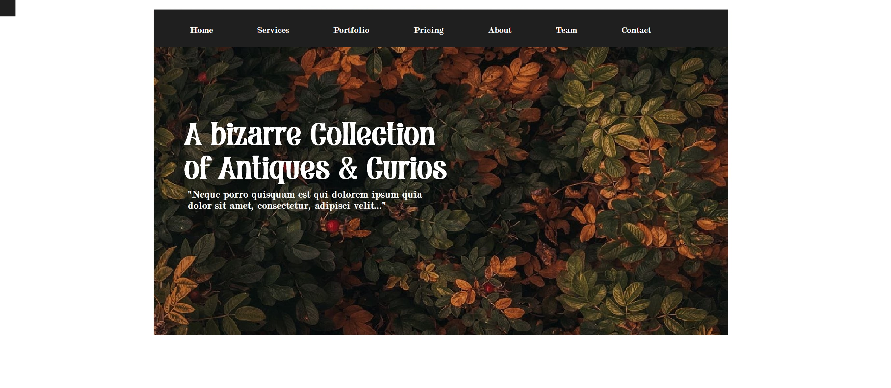
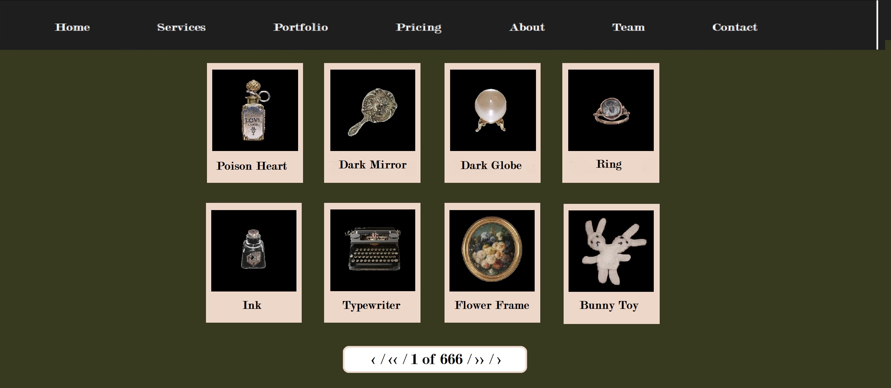
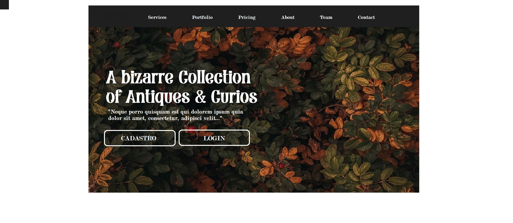
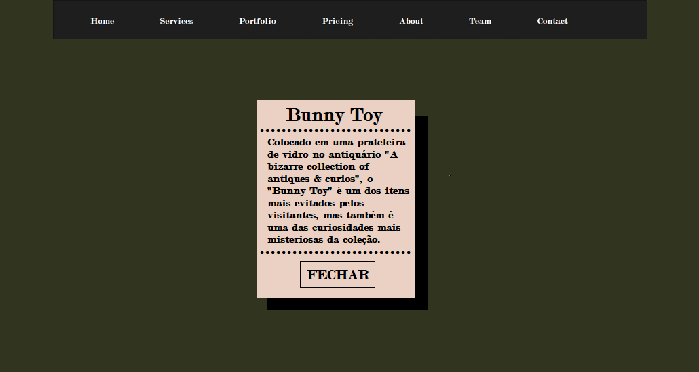

# SAgrupo4
Antiquário Online
Bem-vindo ao nosso Antiquário Online! Este repositório contém o código-fonte do nosso site de estoque, onde você pode explorar e adquirir peças únicas e valiosas de nosso acervo, e por um bom preço.

Descrição do Projeto
Tecnologias Utilizadas
Instalação
Uso
Contribuições
Licença
Contato

Descrição do Projeto
O Antiquário Online é uma plataforma que permite aos usuários navegar por um catálogo de itens vintage, incluindo móveis, arte, utensílios e muito mais. O objetivo é fornecer uma experiência de compra fácil e agradável, destacando a história e a singularidade de cada peça.

Tecnologias Utilizadas
Frontend: HTML, CSS, JavaScript
Backend: Node.js, 
Banco de Dados: BR Modelo

Uso
Navegar pelo Catálogo: Explore as diferentes categorias de itens.
Buscar Itens: Utilize a barra de pesquisa para encontrar peças específicas.
Contribuições
Contribuições são bem-vindas! Sinta-se à vontade para abrir uma issue ou enviar um pull request.

Requisitos Funcionais (RF)
RF01 - O sistema deve permitir o registro de itens com descrição detalhada (origem, período, materiais).

RF02 - O sistema deve registrar o status de conservação de cada item.

RF03 - O sistema deve permitir o upload de imagens de alta resolução para cada item.

RF04 - O sistema deve permitir a anotação da colocação física no depósito de cada item.

RF05 - O sistema deve oferecer uma busca interna por categorias, período e status de conservação.

RF06 - O sistema deve permitir o agrupamento de itens em coleções temáticas.

RF07 - O sistema deve manter um histórico de alterações em itens (informações, localização, restaurações).

RF08 - O sistema deve permitir a geração de relatórios sobre a coleção ou coleções específicas.

RF9 - O sistema deve disponibilizar um espaço para anotações privadas sobre itens.

RF10 - O sistema deve ter uma interface intuitiva e menus de fácil acesso.

Requisitos Não Funcionais (RNF)

RNF01 - O sistema deve suportar até 10.000 itens registrados.

RNF02 - O tempo de resposta para buscas deve ser de no máximo 2 segundos.

RNF03 - O sistema deve realizar backups automáticos diariamente.

Licença
Este projeto está licenciado sob a MIT License. Veja o arquivo LICENSE para mais detalhes.

Contato
Se você tiver alguma dúvida ou sugestão, entre em contato conosco:

Email: contato@antiquarioonline.com
Login Cadastro

